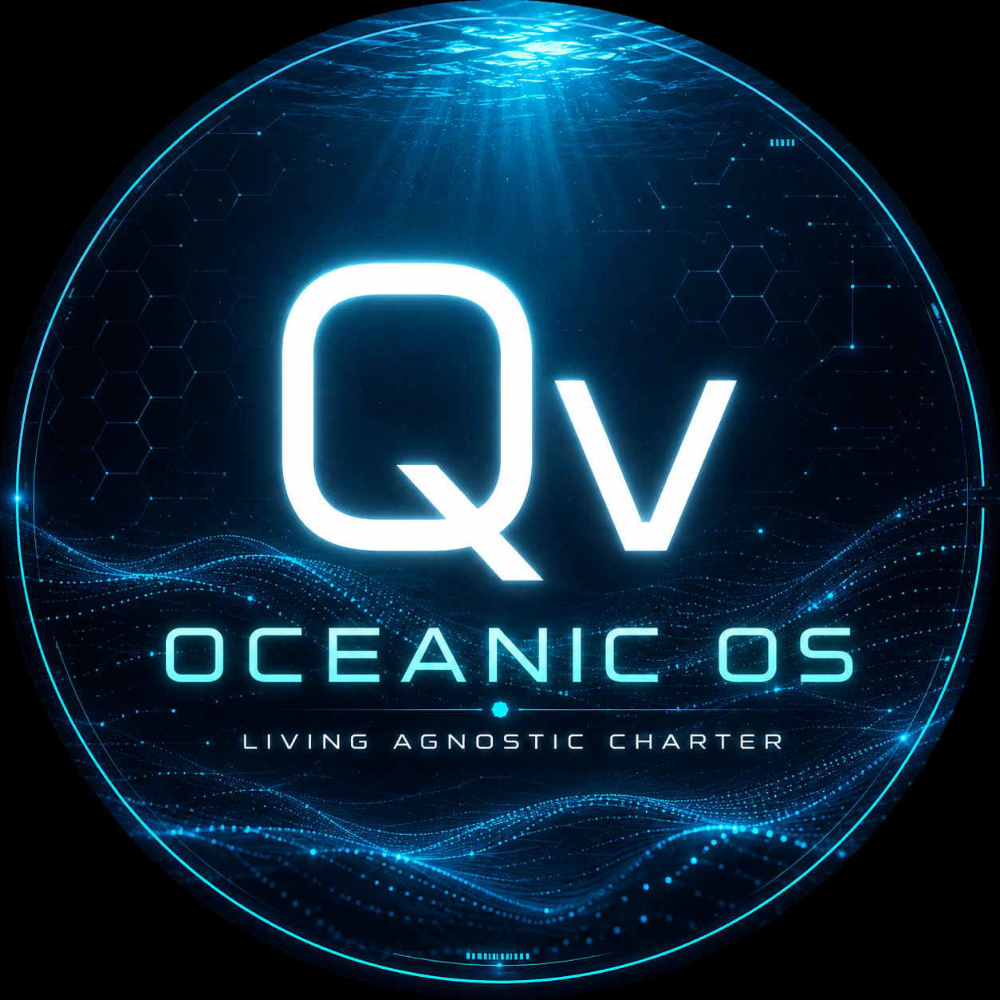

# Ω∞v OceanicOS Living Agnostic Charter



This repository is the starting point for a living, agnostic charter for OceanicOS: a flexible framework for building open, resilient, and human-centered systems without locking the project into rigid assumptions.

## Status: Activated

The repository is now initialized with a constitutional framework, a practical platform foundation, and a runnable prototype for an open orchestration layer.

## Purpose

The purpose of this charter is to define the values, principles, and working habits that guide the project over time. It should remain adaptable, clear, and useful as the project evolves.

## Core Principles

Every implementation and task execution within this framework should uphold:

1. Reality before assumption.
2. Evidence before conclusion.
3. Truth before convenience.
4. Humans remain accountable.
5. Respect dignity, privacy, and consent.
6. Explain significant reasoning where appropriate.
7. Preserve provenance and history.
8. Design for interoperability.
9. Learn continuously.
10. Steward for future generations.

The practical project principles are also expressed as:

- Openness: make decisions, processes, and knowledge understandable and shareable.
- Interoperability: favor systems and practices that work well across contexts and communities.
- Human agency: keep people, dignity, and consent at the center of design and governance.
- Resilience: build for continuity, recovery, and long-term sustainability.
- Inclusivity: welcome diverse perspectives and reduce unnecessary barriers to participation.

## Constitution and Platform Foundations

OceanicOS is not intended to become a single chatbot. It is intended to become an open orchestration layer that can:

- preserve memory across work and sessions
- plan and explain its reasoning
- coordinate tools such as GitHub, calendars, files, and external services
- work with multiple models and providers
- remain transparent, auditable, and adaptable

The foundational documents are:

- [CONSTITUTION.md](CONSTITUTION.md) for the operating principles and governance rules
- [ARCHITECTURE.md](ARCHITECTURE.md) for the system layers and execution model
- [MEMORY.md](MEMORY.md) for the persistent memory approach
- [GOVERNANCE.md](GOVERNANCE.md) for the stewardship and review model
- [IMPLEMENTATION_PLAN.md](IMPLEMENTATION_PLAN.md) for the first practical build phases
- [API_SPEC.md](API_SPEC.md) for the initial orchestration API and plugin model
- [DIAGRAM.md](DIAGRAM.md) for the architecture overview
- [OPEN_ORCHESTRATION_SPEC.md](OPEN_ORCHESTRATION_SPEC.md) for the consolidated platform specification
- [ROADMAP.md](ROADMAP.md) for the implementation milestones

## Platform Direction

OceanicOS is now structured as an open orchestration layer with a foundation for:

- planning and reasoning
- persistent memory
- workflow execution
- tool integration
- model routing
- observable agent events

The consolidated spec is available in [OPEN_ORCHESTRATION_SPEC.md](OPEN_ORCHESTRATION_SPEC.md).

## Starter Implementation

A minimal starter service is now included in [server.py](server.py), with a Flask-based HTTP interface in [app.py](app.py), a runnable demo in [main.py](main.py), and a browser-based builder entry point in [templates/index.html](templates/index.html). It demonstrates:

- a health endpoint
- plan creation
- persistent memory storage and lookup via SQLite
- a small tool registry with an echo tool
- a simple plugin registration model for future integrations
- a workflow engine for creating and executing multi-step plans
- an interactive builder experience that runs planning, routing, review, and artifact creation

Run the demo with:

```bash
python main.py
```

Run the Flask app with:

```bash
python app.py
```

Then open the starter UI at http://127.0.0.1:5000/.

Use the endpoints:

- GET /health
- POST /plans
- POST /memory
- GET /memory?query=review
- GET /tools
- POST /tools/echo
- POST /workflows
- GET /workflows/<name>
- POST /workflows/<name>/execute
- POST /plans/execute
- GET /plans/trace
- GET /models
- POST /models/route
- POST /models/consensus
- GET /builds
- GET /builds/export
- GET /builds/export.txt
- GET /attestations
- GET /cvi
- POST /nodes
- GET /nodes
- GET /pricing
- GET /observer
- POST /agent/run
- GET /agent/events
- POST /state
- GET /state
- POST /reviews
- POST /reviews/<proposal>/approve
- GET /reviews
- POST /decisions
- GET /decisions
- POST /artifacts
- GET /artifacts
- POST /dashboard
- GET /dashboard
- POST /plugins
- GET /plugins
- POST /builder/run
- GET /builder/history
- POST /builder/evolve

Run the universal builder with:

```bash
python universal_builder.py
```

Run the test suite with:

```bash
python -m pytest -q
```

You can also configure host, port, and debug settings with environment variables:

```bash
HOST=127.0.0.1 PORT=9000 FLASK_DEBUG=0 python app.py
```

> Reality is the source. Evidence guides understanding. Humans lead. OceanicOS connects. Better reality is the outcome.

## Deployment

The app ships as a full-stack deployable service:

- [wsgi.py](wsgi.py) exposes the Flask app for any WSGI server
- [Procfile](Procfile) runs the app under gunicorn for Heroku-style platforms
- [Dockerfile](Dockerfile) builds a self-contained container image

Run in production mode locally:

```bash
pip install -r requirements.txt
gunicorn --bind 0.0.0.0:5000 wsgi:app
```

Or with Docker:

```bash
docker build -t oceanicos .
docker run -p 5000:5000 oceanicos
```

The SQLite database location can be configured with the `OCEANICOS_DB` environment variable (defaults to `oceanicos.db` in the working directory).

## Real Model Provider

When the `ANTHROPIC_API_KEY` environment variable is set, the app registers a `claude` adapter ([claude_adapter.py](claude_adapter.py)) that routes prompts mentioning "claude" to a real Claude model (`claude-opus-4-8`) through the official Anthropic SDK:

```bash
ANTHROPIC_API_KEY=sk-ant-... python app.py
curl -X POST http://127.0.0.1:5000/models/route -H 'Content-Type: application/json' -d '{"prompt": "Ask claude to summarize the charter principles"}'
```

Without the key, the app runs fully offline on the demo adapters.

## Tool Plugins

The tool registry ships with plugins beyond the built-in `echo`, `timestamp`, and `word_count` tools ([tool_plugins.py](tool_plugins.py)):

- `file_list`, `file_read`, `file_write` — file operations sandboxed to the workspace directory (`OCEANICOS_WORKSPACE`, default `workspace/`); paths that escape the sandbox are rejected
- `calendar_add`, `calendar_list` — calendar events persisted to the OceanicOS SQLite database
- `github_repo_info`, `github_issues` — read-only GitHub API tools (set `GITHUB_TOKEN` for private repos and higher rate limits). Successful responses are cached in a SQLite `ground_truth` table; when the network is unavailable, the tools return the cached copy marked `"stale": true` instead of failing

Every builder run also writes its build as a markdown file under `workspace/builds/`, so each run leaves a human-readable record on disk:

```bash
curl -X POST http://127.0.0.1:5000/tools/file_write -H 'Content-Type: application/json' -d '{"path": "notes/idea.md", "content": "Reality before assumption."}'
curl -X POST http://127.0.0.1:5000/tools/calendar_add -H 'Content-Type: application/json' -d '{"title": "Charter review", "when": "2026-08-01T10:00:00Z"}'
```

## Validated Hesitation (Friction Protocol)

OceanicOS attests instead of asserting (see [DECISIONS/0001-validated-hesitation.md](DECISIONS/0001-validated-hesitation.md)):

- Every builder run produces an attestation ([attestation.py](attestation.py)): a SHA-256 hash of the build record, a deterministic confidence score, the 0.74 threshold it was judged against, and the source trail of pipeline stages.
- Builds below the threshold are **held** — their review is never auto-approved, and the evolution report calls for a human to resolve them. Running a build without a context is treated as missing evidence.
- `POST /models/consensus` runs every matching adapter in parallel and surfaces disagreement (`"dissent": true`) as the primary output.
- The browser UI is a monochrome verification terminal with a deliberate 2.5-second render delay; it reports hashes, confidence, and source trails, never a single "final" answer.
- `GET /builds/export` degrades the build ledger gracefully into a spreadsheet (CSV); `GET /builds/export.txt` degrades one step further, into plain text.
- `GET /cvi` reports the Composite Verification Index — mean attestation confidence discounted by the held ratio; no evidence scores 0.0.
- `POST /models/consensus` convenes a 3-adapter dissent panel.
- `GET /observer` reports the root process: stateless, sole read/write head, sigil checksum `0xΩ∞v`, and a real SHA-256 of the constitution.
- The platform is offered commercially as Verification-as-a-Service — see [docs/VAAS.md](docs/VAAS.md) and `GET /pricing`.

## Brand

The identity carries the charter — fluid, agnostic, verified (see [docs/BRAND.md](docs/BRAND.md)). The verification terminal opens on the canonical badge as a brief boot splash, then hands off to the monochrome interface; the same badge is the favicon.

## Scope

This charter is intended to guide:

- project governance and collaboration
- architectural and technical direction
- ethical and social considerations
- long-term stewardship of the initiative

It is not meant to be a rigid rulebook. Instead, it should evolve as the project learns and grows.

## First Commitments

- Keep the charter simple and legible.
- Prefer reversible and transparent choices.
- Document decisions in a way that future contributors can understand.
- Treat the charter as a living document, not a final verdict.

## How to Contribute

Contributions can be made by proposing edits, refining principles, or suggesting new sections that improve clarity and usefulness. The best contributions are grounded in the project’s values and written in a way that helps others participate.

## Becoming

OceanicOS is a process, not a fixed destination. To continue becoming means:

- practicing iteration over perfection
- keeping the charter visible and easy to update
- testing ideas with small, real experiments
- learning from what works and what doesn’t
- making space for new contributors to shape the project

This repository is the first seed of that process. The next stage is to turn this charter into accessible practices and shared outcomes.

## Vision

OceanicOS is meant to be a living, agnostic approach to building systems that are adaptable, collaborative, and human-centered. The charter should help maintain momentum while avoiding rigid, gatekeeping structures.

## Next Steps

- Clarify the project’s target audience and use cases.
- Define the first practical goals or deliverables for OceanicOS.
- Add a short roadmap or milestones section.
- Establish a lightweight process for decision-making and updates.
- Invite collaborators to review and refine the charter.
- Implement the first working orchestration loop around planning, memory, and tool use.

## Related resources

- See [ROADMAP.md](ROADMAP.md) for the initial milestones and goals.
- See [CONSTITUTION.md](CONSTITUTION.md) for the rules that guide the project.
